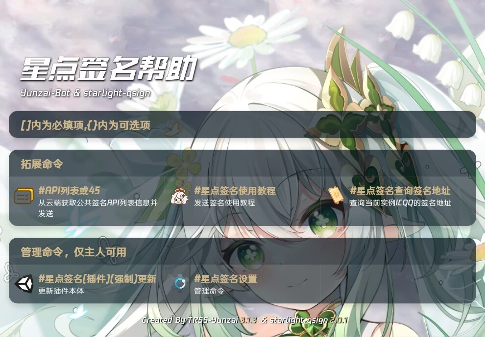
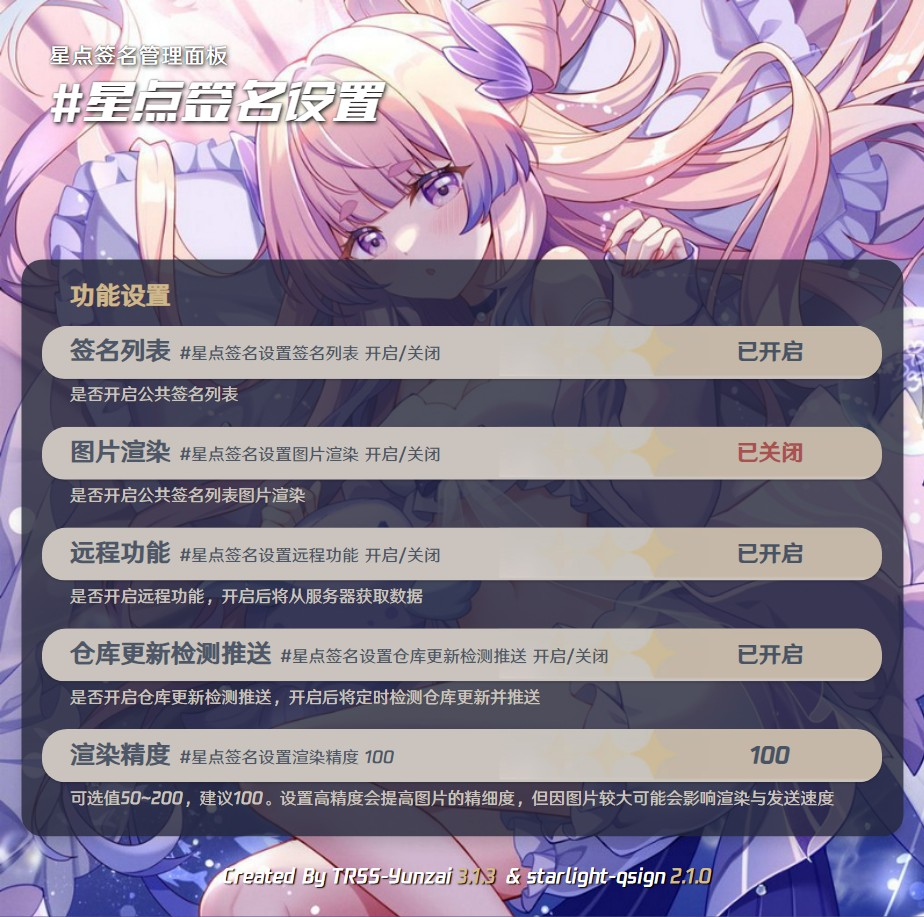
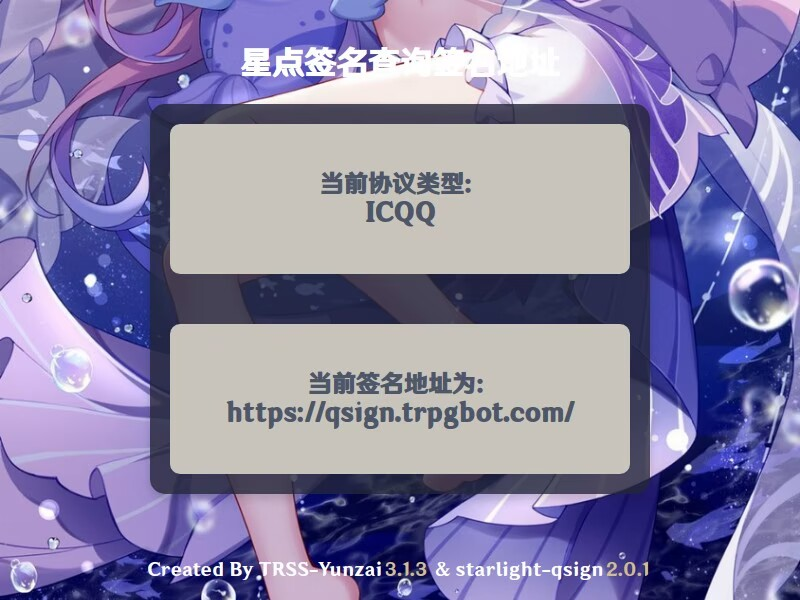

# <center>starlight-qsign</center>

<br>
[](https://github.com/wuliya336/starlight-qsign)[](https://gitee.com/Le-niao/Yunzai-Bot)<br>
`starlight-qsign`是一个`Yunzai-Bot`的扩展插件，提供公共签名列表，45解决方案功能<br>

---

<mark>本插件，已跑路，仅保证功能可用<mark>

## 安装与更新

### 使用Git安装（推荐）

#### **使用Github**

```
git clone --depth=1 https://github.com/wuliya336/starlight-qsign ./plugins/starlight-qsign/
```

```
pnpm install --filter=starlight-qsign
```

#### **使用GitHub镜像**

```
git clone --depth=1 https://gh.wuliya.icu/github.com/wuliya336/starlight-qsign ./plugins/starlight-qsign/
```

```
pnpm install --filter=starlight-qsign
```

### 手工下载安装（不推荐）

**手工下载安装包，解压后将`starlight-qsign-master`更名为`starlight-qsign`，然后放置在Yunzai的plugins目录内<br>**

**虽然此方式能够使用，不利于后续升级，故不推荐使用<br>**

---

## 使用帮助

## 本插件支持本地与远程切换

**对机器人发送`#星点签名帮助`可获取本插件帮助<br>**
<br>
**对机器人发送<span style="color: red;">`#API列表`或`45`</span>即可获取本插件所收集的公共签名列表<br>**
**如需更新发送<span style="color: orange;">`#星点签名更新`</span>,如需设置发送<span style="color: orange;">`#星点签名设置`</span>**
<br>
**新增API查看功能**

**<span style="color: orange;">`#星点签名查询签名地址`</span>**



## 贡献

**如果你也想参与贡献并提供自己所搭建的签名服务,请提交并pr<br>**
**如果你有多余的服务器想提供也可联系我**

### 如何提交

**一. 修改`api`分支下的`signlist.json`文件,请参考json数组并提交<br>**

```json
"name": [
  {
    "txlib": "signurl",
    "memo": "info"
  }
]
```

#### 参数说明

##### 本插件支持本地与远程

| 参数  | 说明       | 备注                       |
| ----- | ---------- | -------------------------- |
| name  | 提供者名称 | 如: example                |
| txlib | 签名版本   | 如: 9.0.60                 |
| sign  | 签名地址   | 如: http://example.com     |
| memo  | 备注       | 无                         |
| date  | 提交日期   | 如: 2024-09-06, 仅本地模式 |

## 更新计划

- [x] 获取当前实例签名地址
- [ ] ~~自动切换可用签名~~
- [x] 备注信息

# 资源

- [Miao-Yunzai](https://github.com/yoimiya-kokomi/Miao-Yunzai) : 喵版Yunzai [Gitee](https://gitee.com/yoimiya-kokomi/Miao-Yunzai)
  / [Github](https://github.com/yoimiya-kokomi/Miao-Yunzai)
- [Yunzai-V3](https://github.com/yoimiya-kokomi/Yunzai-Bot) ：Yunzai V3 - 喵喵维护版（使用 icqq）
- [Yunzai-V3](https://gitee.com/Le-niao/Yunzai-Bot) ：Yunzai V3 - 乐神原版（使用 oicq）
