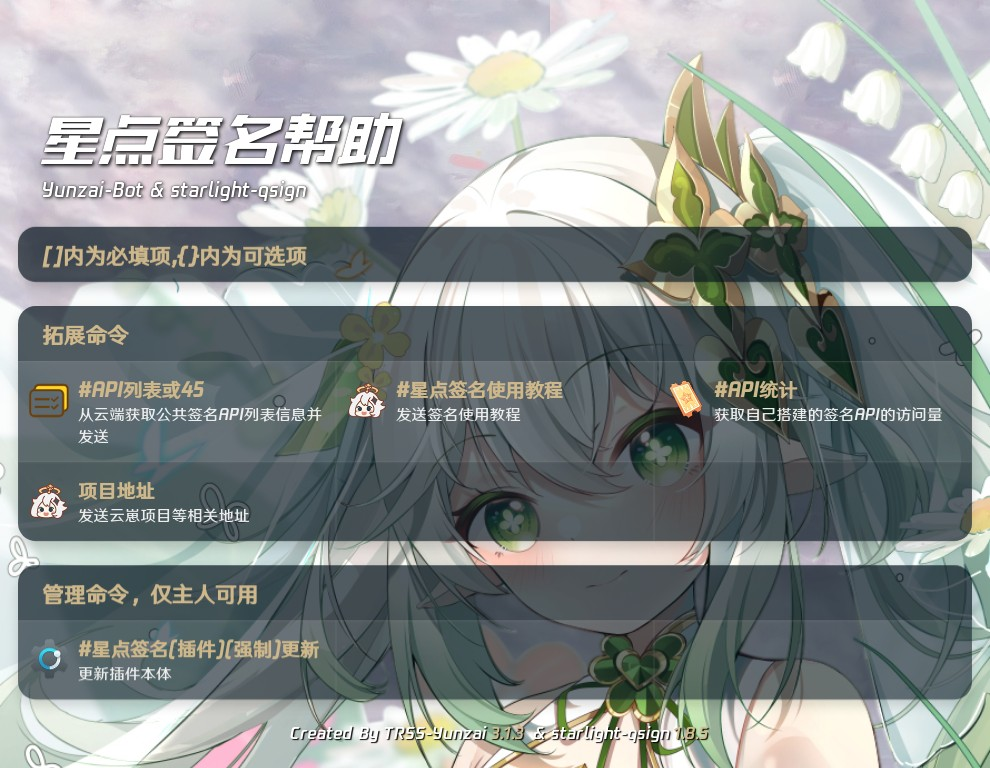
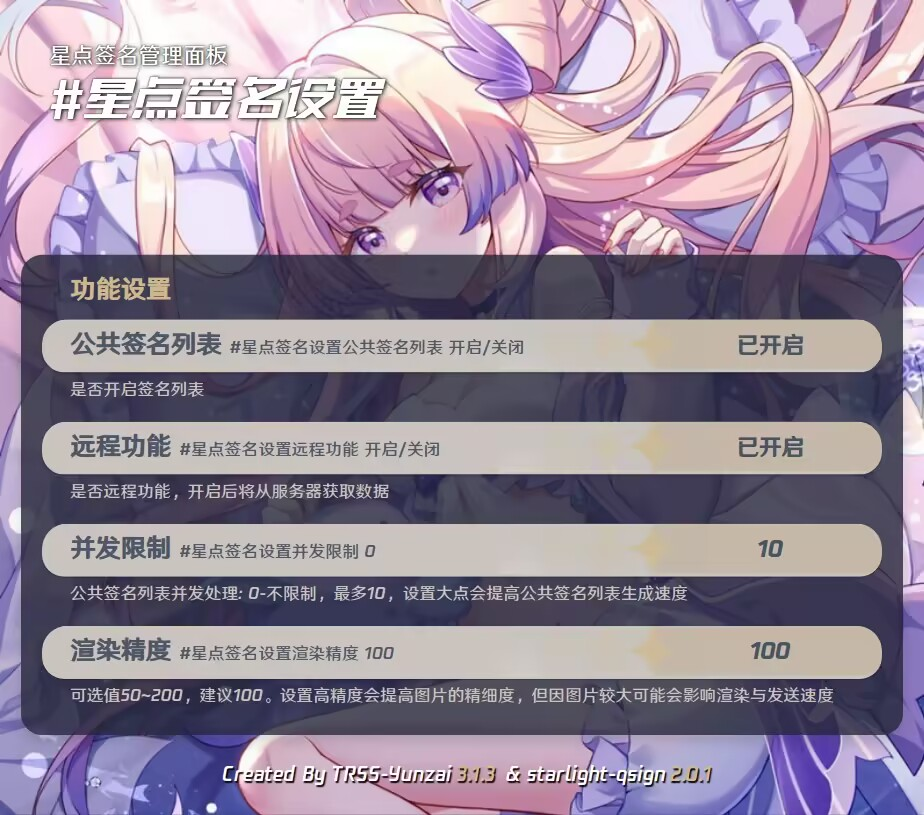
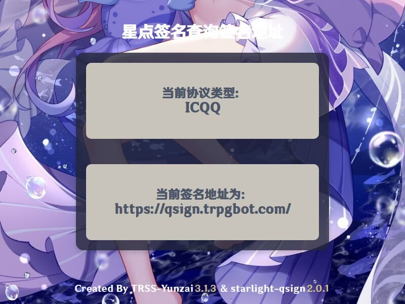

# <center>starlight-qsign</center>

<br>
[](https://gitlab.com/v17360963/starlight-qsign)[](https://github.com/wuliya336/starlight-qsign)[](https://gitee.com/Le-niao/Yunzai-Bot)<br>
starlight-qsign`是一个`Yunzai-Bot`的扩展插件，提供公共签名列表，45解决方案功能<br>

---
<mark>谈恋爱去了，暂停更新，有缘再见<mark>
## 安装与更新

### 使用Git安装（推荐）

**请将 `starlight-qsign` 放置在 Yunzai-Bot 的 plugins 目录下，重启 Yunzai-Bot 后即可使用<br>**

**请使用 git 进行安装，以方便后续升级。在 Yunzai-Bot 根目录夹打开终端，运行下述指令之一<br>**

#### **使用Gitlab**

```
git clone --depth=1 https://gitlab.com/v17360963/starlight-qsign.git ./plugins/starlight-qsign/
```

~~~
pnpm install --filter=starlight-qsign
~~~

#### **使用Github**

~~~
git clone --depth=1 https://github.com/wuliya336/starlight-qsign.git ./plugins/starlight-qsign/
~~~

~~~
pnpm install --filter=starlight-qsign
~~~

### 手工下载安装（不推荐）

**手工下载安装包，解压后将`starlight-qsign-master`更名为`starlight-qsign`，然后放置在Yunzai的plugins目录内<br>**

**虽然此方式能够使用，不利于后续升级，故不推荐使用<br>**

---

## 使用帮助

**对机器人发送`#星点签名帮助`可获取本插件帮助<br>**
<br>

**发送`#星点签名设置`**



**设置好开关后**

**对机器人发送<span style="color: red;">`#API列表`或`45`</span>即可获取本插件所收集的公共签名列表<br>**

**如需更新发送<span style="color: orange;">`#星点签名更新`</span>,如需设置发送<span style="color: orange;">`#星点签名设置`</span>**

**新增API查看功能**

**<span style="color: orange;">`#星点签名查询签名地址`</span>**



## 贡献

**如果你也想参与贡献并提供自己所搭建的签名服务,请提交并pr<br>**
**如果你有多余的服务器想提供也可联系我**

### 如何提交

**一. 修改`api`分支下的`signlist.json`文件,请参考json数组并提交<br>**

```json
"name": [
  {
    "txlib": "signurl",
    "memo": "info"
  }
]
```

#### 参数说明

**`name`为提供者名称<br>**
**`txlib`为协议版本<br>**
**`sign`为签名地址<br>**
**`memo`为可选项，`info`用于输出备注，可放统计量，签名主站，不可放置广告<br>**

## 更新计划

- [ ] V4重构
- [ ] ~~统计量定时推送~~
- [x] 备注信息

# 资源

* [Miao-Yunzai](https://github.com/yoimiya-kokomi/Miao-Yunzai) : 喵版Yunzai [Gitee](https://gitee.com/yoimiya-kokomi/Miao-Yunzai)
  / [Github](https://github.com/yoimiya-kokomi/Miao-Yunzai)
* [Yunzai-V3](https://github.com/yoimiya-kokomi/Yunzai-Bot) ：Yunzai V3 - 喵喵维护版（使用 icqq）
* [Yunzai-V3](https://gitee.com/Le-niao/Yunzai-Bot) ：Yunzai V3 - 乐神原版（使用 oicq）
